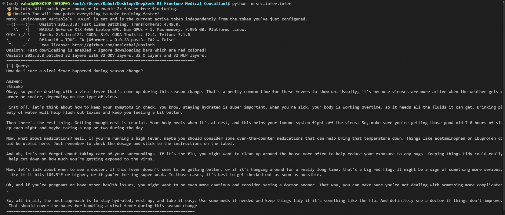

# DeepSeek-Finetuned-with-LoRA-on-Medical-Dataset

<div align="center">
  
</div>


[](https://huggingface.co/devrahulbanjara/DeepSeek-R1-Distill-Llama-8B-medical-finetune)

## Overview

This repository contains the code and resources for fine-tuning the DeepSeek-R1-Distill-Llama-8B model for medical consultation tasks. The fine-tuned model is designed to provide accurate, reliable medical information and reasoning based on user queries, serving as a virtual medical consultant.

The LoRA adapter weights are available on Hugging Face: [DeepSeek-R1-Distill-Llama-8B-medical-finetune](https://huggingface.co/devrahulbanjara/DeepSeek-R1-Distill-Llama-8B-medical-finetune)

> **Note**: The Hugging Face repository contains only the LoRA adapter weights, not the full model weights. The adapter needs to be combined with the base model for inference.

## Table of Contents

- [Features](#features)
- [Repository Structure](#repository-structure)
- [Tech Stack](#tech-stack)
- [Hardware Requirements](#hardware-requirements)
- [Installation](#installation)
- [Usage](#usage)
  - [Fine-tuning](#fine-tuning)
  - [Inference](#inference)
  - [Model Deployment](#model-deployment)
- [Configuration](#configuration)
- [Dataset](#dataset)
- [Results](#results)
- [Contributing](#contributing)
- [License](#license)
- [Acknowledgements](#acknowledgements)

## Features

- Fine-tuning of DeepSeek-R1-Distill-Llama-8B model on medical datasets
- Optimized training using Unsloth for faster and more efficient fine-tuning
- 4-bit quantization for reduced memory footprint
- Inference pipeline for medical consultation queries
- Integration with Weights & Biases for experiment tracking
- Hugging Face Hub integration for model sharing and deployment

## Repository Structure

```
DeepSeek-R1-Finetune-Medical-Consultant/
├── config/                  # Configuration files and environment settings
├── data/                    # Training and evaluation datasets (with citations)
├── docs/                    # Documentation files
├── notebooks/               # Jupyter notebooks for exploration and analysis
├── outputs/                 # Model checkpoints and training outputs (not in repo - gitignored)
├── src/                     # Source code
│   ├── data/                # Data processing utilities
│   ├── finetune/            # Fine-tuning scripts and utilities
│   ├── infer/               # Inference scripts
│   ├── prompts/             # Prompt templates for model interaction
│   └── utils/               # Utility functions
├── wandb/                   # Weights & Biases logs (not in repo - gitignored)
├── .gitignore               # Git ignore file
├── requirements.txt         # Python dependencies
└── README.md                # This file
```

> **Note**: The `outputs/` and `wandb/` directories are included in `.gitignore` and won't appear in the repository. These directories are generated during training and contain model checkpoints and experiment logs.

## Tech Stack

- **Python**: 3.10+
- **Deep Learning Framework**: PyTorch 2.5.1+cu124
- **Model**: DeepSeek-R1-Distill-Llama-8B
- **Optimization**: Unsloth 2025.3.8, PEFT 0.14.0
- **Training**: TRL 0.14.0, XFormers 0.0.28
- **Experiment Tracking**: Weights & Biases 0.19.11
- **Model Serving**: Hugging Face Transformers 4.49.0
- **Other**: python-dotenv 1.1.0, scikit-learn 1.6.1

## Hardware Requirements

This project was trained on:

- **GPU**: NVIDIA GeForce RTX 4060 Laptop GPU (8 GB VRAM)
- **Memory**: 16 GB RAM recommended

> **Hardware Limitations**: Due to the 8 GB VRAM constraint of the RTX 4060 Laptop GPU, the maximum sequence length was limited to 800 tokens. Increasing this value would exponentially increase VRAM usage, leading to out-of-memory errors during training. For longer sequence lengths, more powerful GPUs with larger VRAM capacity would be required.

## Installation

### Prerequisites

- CUDA-compatible GPU (CUDA 12.4 recommended)
- Python 3.10+
- Git

### Environment Setup

1. Clone the repository:

```bash
git clone https://github.com/username/DeepSeek-R1-Finetune-Medical-Consultant.git
cd DeepSeek-R1-Finetune-Medical-Consultant
```

2. Create and activate a Conda environment:

```bash
conda create -n medical-llm python=3.10
conda activate medical-llm
```

3. Install dependencies:

```bash
pip install -r requirements.txt
```

4. Set up environment variables:
   Create a `.env` file in the root directory with the following variables:

```
HF_TOKEN=your_huggingface_token
WANDB_API_KEY=your_wandb_api_key
```

## Usage

### Fine-tuning

The fine-tuning process uses Unsloth for optimized training of the DeepSeek-R1-Distill-Llama-8B model. Run the following command from the root directory of the project:

```bash
python -m src.finetune.trainer
```

This script loads the base model, applies LoRA adapters, and fine-tunes on medical data with optimized parameters.

### Inference

To run inference with the fine-tuned model, execute the following command from the root directory:

```bash
python -m src.infer.infer
```

The script loads the fine-tuned model and runs inference on sample medical queries, demonstrating the model's capabilities in providing medical consultation.

### Model Deployment

To push the fine-tuned model to Hugging Face Hub:

```bash
python -m src.utils.push_to_huggingfacehub
```

This uploads the model and tokenizer to the specified Hugging Face repository for sharing and deployment.

## Configuration

Configuration settings are managed in the `config/settings.py` file, which loads environment variables from the `.env` file:

- `HF_TOKEN`: Hugging Face API token for model access and uploads
- `WANDB_API_KEY`: Weights & Biases API key for experiment tracking

## Dataset

The model was trained on a curated medical dataset comprising clinical cases, medical consultations, and healthcare-related queries. Detailed citations and dataset information can be found in the `data/` directory.

> **Note**: Please refer to the citation files within the `data/` directory for proper attribution of the datasets used in this project.

## Key Files

- **src/finetune/trainer.py**: Implements the fine-tuning process using Unsloth optimization and LoRA adapters.
- **src/infer/infer.py**: Provides inference capabilities using the fine-tuned model for medical consultation queries.
- **src/utils/push_to_huggingfacehub.py**: Handles the process of pushing the fine-tuned model to Hugging Face Hub.
- **src/prompts/infer_prompt_template.py**: Defines the prompt template used for structuring medical queries during inference.
- **config/settings.py**: Manages environment variables and configuration settings for the project.

## Results

The fine-tuned model demonstrates improved performance in medical consultation tasks, including:

- Accurate diagnosis suggestions based on reported symptoms
- Evidence-based treatment recommendations
- Clear explanations of medical concepts
- Appropriate medical reasoning

Detailed performance metrics and evaluation results can be found in the notebooks directory.

## Quick Start

To quickly test the model with your own medical queries:

1. Ensure you have set up the environment as described in the Installation section
2. Run the inference script with your query:

```bash
python -m src.infer.infer "What are the symptoms of pneumonia?"
```

## Troubleshooting

Common issues and their solutions:

- **CUDA out of memory error**: Reduce batch size or sequence length in the configuration
- **Missing Hugging Face token**: Ensure your `.env` file contains a valid `HF_TOKEN`
- **Import errors**: Verify that all dependencies are installed with the correct versions

## Contributing

Contributions are welcome! Please feel free to submit a Pull Request.

1. Fork the repository
2. Create your feature branch (`git checkout -b feature/amazing-feature`)
3. Commit your changes (`git commit -m 'Add some amazing feature'`)
4. Push to the branch (`git push origin feature/amazing-feature`)
5. Open a Pull Request

## License

This project is licensed under the GNU General Public License v2.0 (GPL-2.0) - see the LICENSE file for details.

Copyright (C) 1989, 1991 Free Software Foundation, Inc.,
51 Franklin Street, Fifth Floor, Boston, MA 02110-1301 USA

## Acknowledgements

- [DeepSeek AI](https://deepseek.ai/) for the base model
- [Unsloth](https://github.com/unslothai/unsloth) for optimization techniques
- [Hugging Face](https://huggingface.co/) for model hosting and transformers library
- [Weights & Biases](https://wandb.ai/) for experiment tracking
